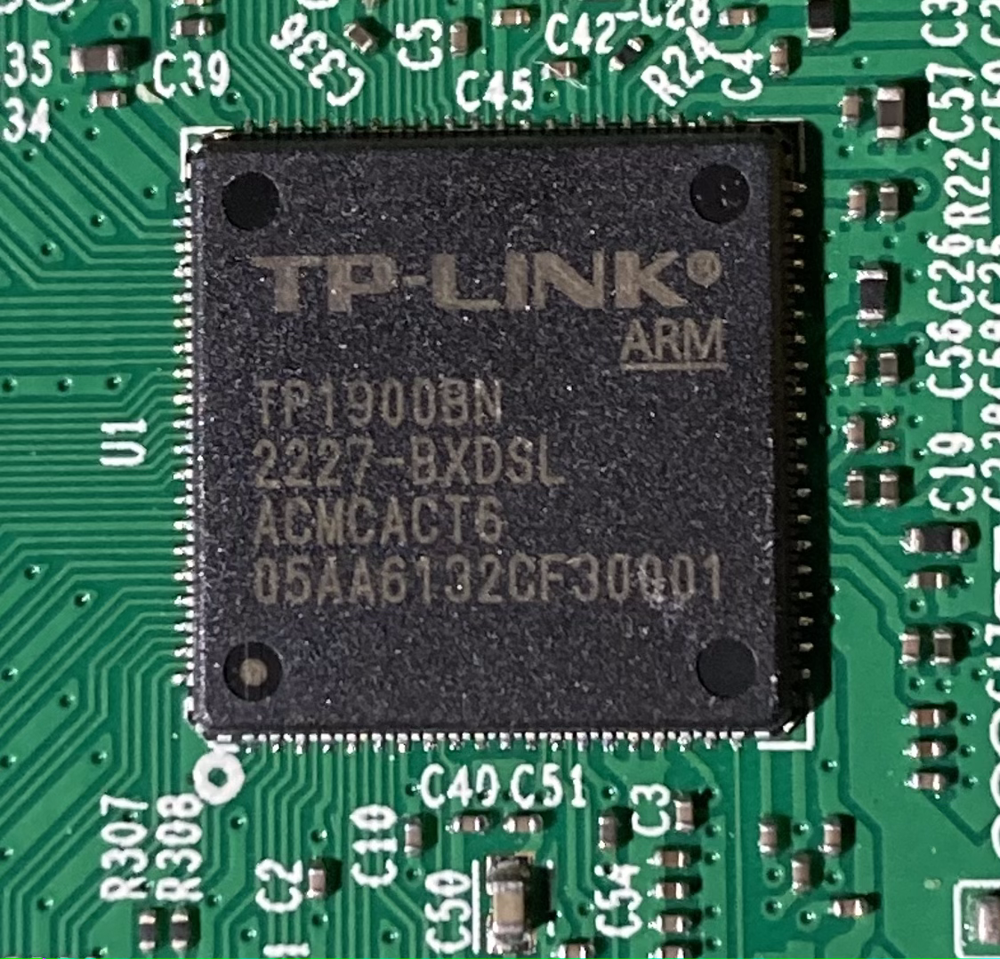
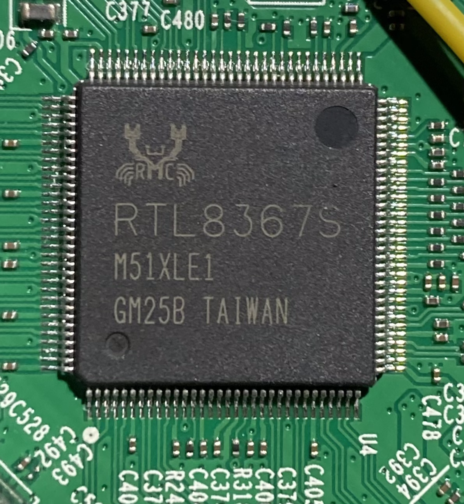
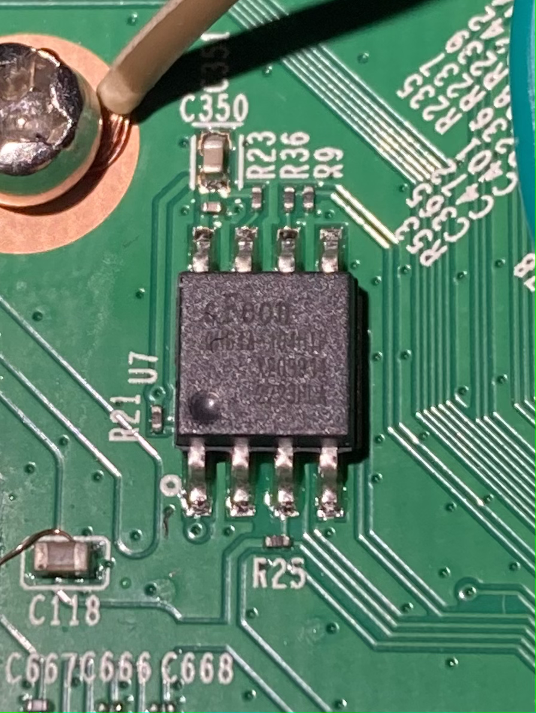
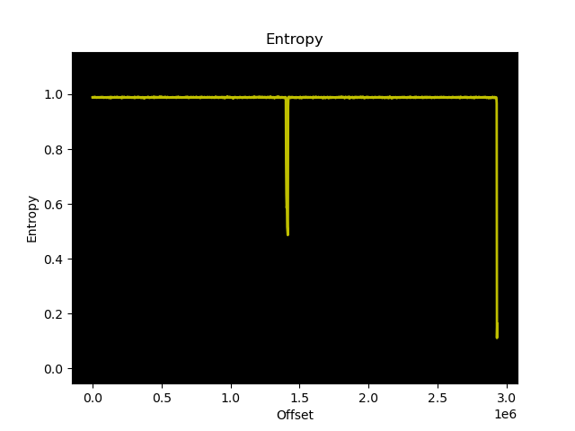
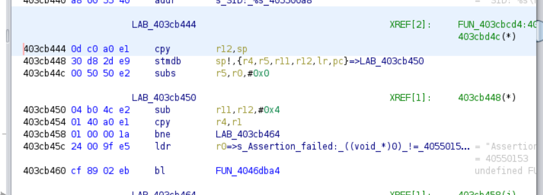
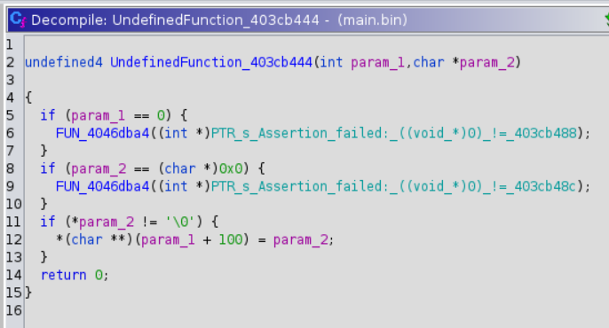

# TP-Link Archer C6 v4 (EU)

This repository aims to reverse engineer the TP-Link Archer C6 v4 (Europe Version). At the time, these are just my notes on it after a week of work. If you want to collaborate or just to say hi, don't hesitate to contact me!

*   [Official docs](https://www.tp-link.com/es/home-networking/wifi-router/archer-c6/)

## Hardware

### CPU

It uses a custom CPU named `TP-Link ARM TP1900BN 2227-BXDSL ACMCACT6 05AA6132CF30001`.

I found out that TP-Link Archer C8 (US) router is nearly identical to this model, including the CPU, except that it is labeled as `Mediatek TP1900BN 1945-BXDSL ACMCN611 05AA69191180006`, which seems to be a previous revision. Also found [here](https://forum.openwrt.org/t/tp-link-archer-c80-2020-will-it-be-supported/60897) that `TP1900BN` and `MT7626B(N)` are different names for the same SOC, which runs **ARM Cortex-A7020-will-it-be-supported/60897) that `TP1900BN` and `MT7626B(N)` are different names for the same SOC, which runs **ARM Cortex-A7**. Besides, when booting the device, there's a message through UART confirming this: `Hello, MT7626 E2`.

### Ethernet controller

### Flash

## External analysis

Ran `nmap` in the LAN side:

	# Nmap 7.80 scan initiated Sat Dec 31 13:40:13 2022 as: nmap -sV -p- -Pn -oN /home/hacefresko/Desktop/nmap.log 192.168.1.1
	Nmap scan report for _gateway (192.168.1.1)
	Host is up (0.0014s latency).
	Not shown: 65527 filtered ports
	PORT  	STATE  SERVICE    	VERSION
	22/tcp	open   ssh        	OpenSSH 6.6.0 (protocol 2.0)
	53/tcp	open   domain     	dnsmasq 2.78
	80/tcp	open   http
	1900/tcp  open   upnp?
	20002/tcp open   commtact-http?
	22017/tcp closed unknown
	28975/tcp closed unknown
	30410/tcp closed unknown
	3 services unrecognized despite returning data. If you know the service/version, please submit the following fingerprints at https://nmap.org/cgi-bin/submit.cgi?new-service :
	==============NEXT SERVICE FINGERPRINT (SUBMIT INDIVIDUALLY)==============
	SF-Port80-TCP:V=7.80%I=7%D=12/31%Time=63B02E1A%P=x86_64-pc-linux-gnu%r(Get
	SF:Request,A59,"HTTP/1\.0\x20200\x20OK\r\nContent-Type:\x20text/html;chars
	SF:et=UTF-8\r\nContent-Length:\x202525\r\nConnection:\x20close\r\nCache-co
	SF:ntrol:\x20no-cache\r\n\r\n<!DOCTYPE\x20html><html\x20xmlns=\"http://www
	SF:\.w3\.org/1999/xhtml\"><head><meta\x20http-equiv=\"Content-Type\"\x20co
	SF:ntent=\"text/html;\x20charset=utf-8\"><meta\x20http-equiv=\"X-UA-Compat
	SF:ible\"\x20content=\"IE=edge,chrome=1\"><meta\x20name=\"viewport\"\x20co
	SF:ntent=\"width=device-width,initial-scale=1,minimum-scale=1,maximum-scal
	SF:e=1,user-scalable=0\"><meta\x20name=\"apple-touch-fullscreen\"\x20conte
	SF:nt=\"yes\"><meta\x20name=\"apple-mobile-web-app-capable\"\x20content=\"
	SF:yes\"><meta\x20name=\"apple-mobile-web-app-status-bar-style\"\x20conten
	SF:t=\"black\"><meta\x20name=\"format-detection\"\x20content=\"telephone=n
	SF:o\"><meta\x20name=\"version\"\x20content=\"v202109131151\"><link\x20rel
	SF:=\"shortcut\x20icon\"\x20href=\"favicon\.ico\?t=a57f083a\"><link\x20hre
	SF:f=\"themes/default/css/perfect-scrollbar\.css\?t=a57f083a\"\x20rel=\"st
	SF:ylesheet\"><link\x20id=\"baseCss\"\x20href=\"themes/default/css/base\.c
	SF:ss\?t=a57f")%r(HTTPOptions,89,"HTTP/1\.1\x20405\x20Method\x20Not\x20All
	SF:owed\r\nContent-Type:\x20text/html;charset=UTF-8\r\nContent-Length:\x20
	SF:0\r\nConnection:\x20close\r\nCache-control:\x20no-cache\r\n\r\n")%r(RTS
	SF:PRequest,89,"HTTP/1\.1\x20405\x20Method\x20Not\x20Allowed\r\nContent-Ty
	SF:pe:\x20text/html;charset=UTF-8\r\nContent-Length:\x200\r\nConnection:\x
	SF:20close\r\nCache-control:\x20no-cache\r\n\r\n")%r(FourOhFourRequest,81,
	SF:"HTTP/1\.0\x20403\x20Forbidden\r\nContent-Type:\x20text/plain;charset=U
	SF:TF-8\r\nContent-Length:\x200\r\nConnection:\x20close\r\nCache-control:\
	SF:x20no-cache\r\n\r\n")%r(GenericLines,82,"HTTP/1\.1\x20400\x20Bad\x20Req
	SF:uest\r\nContent-Type:\x20text/html;charset=UTF-8\r\nContent-Length:\x20
	SF:0\r\nConnection:\x20close\r\nCache-control:\x20no-cache\r\n\r\n")%r(Hel
	SF:p,82,"HTTP/1\.1\x20400\x20Bad\x20Request\r\nContent-Type:\x20text/html;
	SF:charset=UTF-8\r\nContent-Length:\x200\r\nConnection:\x20close\r\nCache-
	SF:control:\x20no-cache\r\n\r\n");
	==============NEXT SERVICE FINGERPRINT (SUBMIT INDIVIDUALLY)==============
	SF-Port1900-TCP:V=7.80%I=7%D=12/31%Time=63B02E1A%P=x86_64-pc-linux-gnu%r(G
	SF:etRequest,80,"HTTP/1\.0\x20404\x20Not\x20Found\r\nContent-Type:\x20text
	SF:/html;charset=UTF-8\r\nContent-Length:\x200\r\nConnection:\x20close\r\n
	SF:Cache-control:\x20no-cache\r\n\r\n")%r(GenericLines,82,"HTTP/1\.1\x2040
	SF:0\x20Bad\x20Request\r\nContent-Type:\x20text/html;charset=UTF-8\r\nCont
	SF:ent-Length:\x200\r\nConnection:\x20close\r\nCache-control:\x20no-cache\
	SF:r\n\r\n")%r(HTTPOptions,89,"HTTP/1\.1\x20405\x20Method\x20Not\x20Allowe
	SF:d\r\nContent-Type:\x20text/html;charset=UTF-8\r\nContent-Length:\x200\r
	SF:\nConnection:\x20close\r\nCache-control:\x20no-cache\r\n\r\n")%r(RTSPRe
	SF:quest,89,"HTTP/1\.1\x20405\x20Method\x20Not\x20Allowed\r\nContent-Type:
	SF:\x20text/html;charset=UTF-8\r\nContent-Length:\x200\r\nConnection:\x20c
	SF:lose\r\nCache-control:\x20no-cache\r\n\r\n")%r(Help,82,"HTTP/1\.1\x2040
	SF:0\x20Bad\x20Request\r\nContent-Type:\x20text/html;charset=UTF-8\r\nCont
	SF:ent-Length:\x200\r\nConnection:\x20close\r\nCache-control:\x20no-cache\
	SF:r\n\r\n")%r(TerminalServerCookie,82,"HTTP/1\.1\x20400\x20Bad\x20Request
	SF:\r\nContent-Type:\x20text/html;charset=UTF-8\r\nContent-Length:\x200\r\
	SF:nConnection:\x20close\r\nCache-control:\x20no-cache\r\n\r\n")%r(FourOhF
	SF:ourRequest,1C5,"HTTP/1\.0\x20401\x20Unauthorized\r\nContent-Type:\x20te
	SF:xt/plain;charset=UTF-8\r\nContent-Length:\x20319\r\nConnection:\x20clos
	SF:e\r\nCache-control:\x20no-cache\r\n\r\n00007\r\n00004\r\n00000\r\nx0zur
	SF:u4r\)\|\|5g4sPp7VEYF\x08~d!\]mOxi4\r\n>30t4Xv53Jyi\|0VJ>\]eK\]YlLgA!!0C
	SF:}\^stXoE1\+gP>3\|gPX}uXzr}tApw~mBw\]36BA\]td\*oMs04ZzS\|gPS\$AEZB{lT}0n
	SF:{r\]\[cmK3smluO\.q\$o6FAB4TPW\]jae\x08v4rt\[!DT9sRr59{NZnMF\$Zye\[V\$Np
	SF:1u1IcvGS7W!\$fig3qVC0n,2>F3\[H\$\)BSqcL9eo>tIC{gDI~b\|s,hX14LOLAtbU0pvG
	SF:05DQLpsXS34dH2slVs\.Vss2i!{C\*OAv\]tW\x08i4\r\n00002\r\n");
	==============NEXT SERVICE FINGERPRINT (SUBMIT INDIVIDUALLY)==============
	SF-Port20002-TCP:V=7.80%I=7%D=12/31%Time=63B02E1C%P=x86_64-pc-linux-gnu%r(
	SF:GenericLines,4,"\x01\0\x03\0")%r(GetRequest,4,"\x01\0\x03\0")%r(HTTPOpt
	SF:ions,4,"\x01\0\x03\0")%r(RTSPRequest,4,"\x01\0\x03\0")%r(RPCCheck,4,"\x
	SF:01\0\x03\0")%r(DNSVersionBindReqTCP,4,"\x01\0\x03\0")%r(DNSStatusReques
	SF:tTCP,4,"\x01\0\x03\0")%r(Help,4,"\x01\0\x03\0")%r(SSLSessionReq,4,"\x01
	SF:\0\x03\0")%r(TerminalServerCookie,4,"\x01\0\x03\0")%r(TLSSessionReq,4,"
	SF:\x01\0\x03\0")%r(Kerberos,4,"\x01\0\x03\0")%r(SMBProgNeg,4,"\x01\0\x03\
	SF:0")%r(X11Probe,4,"\x01\0\x03\0")%r(FourOhFourRequest,4,"\x01\0\x03\0")%
	SF:r(LPDString,4,"\x01\0\x03\0")%r(LDAPSearchReq,4,"\x01\0\x03\0")%r(LDAPB
	SF:indReq,4,"\x01\0\x03\0")%r(SIPOptions,4,"\x01\0\x03\0")%r(LANDesk-RC,4,
	SF:"\x01\0\x03\0")%r(TerminalServer,4,"\x01\0\x03\0")%r(NCP,4,"\x01\0\x03\
	SF:0")%r(NotesRPC,4,"\x01\0\x03\0")%r(JavaRMI,4,"\x01\0\x03\0")%r(WMSReque
	SF:st,4,"\x01\0\x03\0")%r(oracle-tns,4,"\x01\0\x03\0")%r(ms-sql-s,4,"\x01\
	SF:0\x03\0")%r(afp,4,"\x01\0\x03\0")%r(giop,4,"\x01\0\x03\0");
	MAC Address: AC:15:A2:B3:EF:B0 (Unknown)      	 
    	 
	Service detection performed. Please report any incorrect results at https://nmap.org/submit/ .
	# Nmap done at Sat Dec 31 13:42:05 2022 -- 1 IP address (1 host up) scanned in 112.05 seconds

Ran `nmap` in the WAN side, but no port is open by default

### HTTP (web app)

*   Used for configuration the first time the router is accessed (also configured TP-Link account)
*   Requests are encrypted :/

### SSH

Tried to ssh into the route:

	$ ssh root@192.168.1.1
	Unable to negotiate with 192.168.1.1 port 22: no matching key exchange method found. Their offer: diffie-hellman-group1-sha1

It requires some configuration. After tweaking some options, when succesfully login in with the password setup on first boot, the router closes the connection (confirmed this with UART logs). This may happen because neither root nor admin are able to login via ssh remotely

	$ ssh -oKexAlgorithms=+diffie-hellman-group1-sha1 -oHostKeyAlgorithms=+ssh-dss -c aes256-cbc root@192.168.1.1
	TPOS 5 IPSSH Test
	root@192.168.1.1's password:
	Connection to 192.168.1.1 closed by remote host.
    Connection to 192.168.1.1 closed.

### UPnP

*	Performed some recon with [miranda-upnp](https://code.google.com/archive/p/miranda-upnp/) ([logs](logs/miranda.log)). 
*	Cannot perform a Punch in The Hole attack at `WANConnectionDevice:WANIPConnection:AddPortMapping` due to the host validating the IP that sends the request
*	Cannot create malicious Port Forwarding entry with XSS at `WANConnectionDevice:WANIPConnection:AddPortMapping` due to HTML sanitanization

### Mobile App

*   [TP-Link Tether](https://www.tp-link.com/us/tether/) can be used to interact with the router.

## Firmware analysis

Firmware can be downloaded [here](https://static.tp-link.com/upload/firmware/2022/202207/20220713/Archer%20C6(EU)_V4.0_220425.zip)

	$ binwalk c6v4-up-noboot_2022-04-25_17.23.00.bin

	DECIMAL   	HEXADECIMAL 	DESCRIPTION
	--------------------------------------------------------------------------------
	148       	0x94        	uImage header, header size: 64 bytes, header CRC: 0xB2DA8F2, created: 2022-03-31 02:39:24, image size: 66344 bytes, Data Address: 0x41C00000, Entry Point: 0x41C00000, data CRC: 0x9B9B94BB, OS: Firmware, CPU: ARM, image type: Standalone Program, compression type: lzma, image name: "U-Boot 2014.04-rc1 for leopard_e"
	212       	0xD4        	LZMA compressed data, properties: 0x5D, dictionary size: 67108864 bytes, uncompressed size: -1 bytes
	66556     	0x103FC     	LZMA compressed data, properties: 0x6E, dictionary size: 8388608 bytes, uncompressed size: 3718560 bytes
	1417864   	0x15A288    	LZMA compressed data, properties: 0x5D, dictionary size: 8388608 bytes, uncompressed size: -1 bytes
	1613817   	0x189FF9    	LZMA compressed data, properties: 0x5D, dictionary size: 8388608 bytes, uncompressed size: -1 bytes
	1660745   	0x195749    	LZMA compressed data, properties: 0x5D, dictionary size: 8388608 bytes, uncompressed size: -1 bytes
	1679495   	0x19A087    	LZMA compressed data, properties: 0x5D, dictionary size: 8388608 bytes, uncompressed size: -1 bytes
	1745811   	0x1AA393    	LZMA compressed data, properties: 0x5D, dictionary size: 8388608 bytes, uncompressed size: -1 bytes
	1765279   	0x1AEF9F    	LZMA compressed data, properties: 0x5D, dictionary size: 8388608 bytes, uncompressed size: -1 bytes
	1796117   	0x1B6815    	LZMA compressed data, properties: 0x5D, dictionary size: 8388608 bytes, uncompressed size: -1 bytes
	1826090   	0x1BDD2A    	LZMA compressed data, properties: 0x5D, dictionary size: 8388608 bytes, uncompressed size: -1 bytes
	1856034   	0x1C5222    	LZMA compressed data, properties: 0x5D, dictionary size: 8388608 bytes, uncompressed size: -1 bytes
	1883656   	0x1CBE08    	LZMA compressed data, properties: 0x5D, dictionary size: 8388608 bytes, uncompressed size: -1 bytes
	1911288   	0x1D29F8    	LZMA compressed data, properties: 0x5D, dictionary size: 8388608 bytes, uncompressed size: -1 bytes
	1945798   	0x1DB0C6    	LZMA compressed data, properties: 0x5D, dictionary size: 8388608 bytes, uncompressed size: -1 bytes
	1974536   	0x1E2108    	LZMA compressed data, properties: 0x5D, dictionary size: 8388608 bytes, uncompressed size: -1 bytes
	2090688   	0x1FE6C0    	LZMA compressed data, properties: 0x5D, dictionary size: 8388608 bytes, uncompressed size: -1 bytes
	2118427   	0x20531B    	LZMA compressed data, properties: 0x5D, dictionary size: 8388608 bytes, uncompressed size: -1 bytes
	2145071   	0x20BB2F    	LZMA compressed data, properties: 0x5D, dictionary size: 8388608 bytes, uncompressed size: -1 bytes
	2174207   	0x212CFF    	LZMA compressed data, properties: 0x5D, dictionary size: 8388608 bytes, uncompressed size: -1 bytes
	2203103   	0x219DDF    	LZMA compressed data, properties: 0x5D, dictionary size: 8388608 bytes, uncompressed size: -1 bytes
	2231160   	0x220B78    	LZMA compressed data, properties: 0x5D, dictionary size: 8388608 bytes, uncompressed size: -1 bytes
	2258556   	0x22767C    	LZMA compressed data, properties: 0x5D, dictionary size: 8388608 bytes, uncompressed size: -1 bytes
	2286245   	0x22E2A5    	LZMA compressed data, properties: 0x5D, dictionary size: 8388608 bytes, uncompressed size: -1 bytes
	2313652   	0x234DB4    	LZMA compressed data, properties: 0x5D, dictionary size: 8388608 bytes, uncompressed size: -1 bytes
	2341327   	0x23B9CF    	LZMA compressed data, properties: 0x5D, dictionary size: 8388608 bytes, uncompressed size: -1 bytes
	2369579   	0x24282B    	LZMA compressed data, properties: 0x5D, dictionary size: 8388608 bytes, uncompressed size: -1 bytes
	2396504   	0x249158    	LZMA compressed data, properties: 0x5D, dictionary size: 8388608 bytes, uncompressed size: -1 bytes
	2420348   	0x24EE7C    	LZMA compressed data, properties: 0x5D, dictionary size: 8388608 bytes, uncompressed size: -1 bytes
	2447539   	0x2558B3    	LZMA compressed data, properties: 0x5D, dictionary size: 8388608 bytes, uncompressed size: -1 bytes
	2472938   	0x25BBEA    	LZMA compressed data, properties: 0x5D, dictionary size: 8388608 bytes, uncompressed size: -1 bytes
	2503495   	0x263347    	LZMA compressed data, properties: 0x5D, dictionary size: 8388608 bytes, uncompressed size: -1 bytes
	2529095   	0x269747    	LZMA compressed data, properties: 0x5D, dictionary size: 8388608 bytes, uncompressed size: -1 bytes
	2608268   	0x27CC8C    	LZMA compressed data, properties: 0x5D, dictionary size: 8388608 bytes, uncompressed size: -1 bytes
	2649683   	0x286E53    	LZMA compressed data, properties: 0x5D, dictionary size: 8388608 bytes, uncompressed size: -1 bytes
	2662228   	0x289F54    	LZMA compressed data, properties: 0x5D, dictionary size: 8388608 bytes, uncompressed size: -1 bytes
	2690573   	0x290E0D    	LZMA compressed data, properties: 0x5D, dictionary size: 8388608 bytes, uncompressed size: -1 bytes
	2711984   	0x2961B0    	LZMA compressed data, properties: 0x5D, dictionary size: 8388608 bytes, uncompressed size: -1 bytes
	2731855   	0x29AF4F    	LZMA compressed data, properties: 0x5D, dictionary size: 8388608 bytes, uncompressed size: -1 bytes
	2748296   	0x29EF88    	LZMA compressed data, properties: 0x5D, dictionary size: 8388608 bytes, uncompressed size: -1 bytes
	2748810   	0x29F18A    	LZMA compressed data, properties: 0x5D, dictionary size: 8388608 bytes, uncompressed size: -1 bytes
	2767012   	0x2A38A4    	LZMA compressed data, properties: 0x5D, dictionary size: 8388608 bytes, uncompressed size: -1 bytes
	2789766   	0x2A9186    	LZMA compressed data, properties: 0x5D, dictionary size: 8388608 bytes, uncompressed size: -1 bytes
	2822769   	0x2B1271    	LZMA compressed data, properties: 0x5D, dictionary size: 8388608 bytes, uncompressed size: -1 bytes
	2854488   	0x2B8E58    	LZMA compressed data, properties: 0x5D, dictionary size: 8388608 bytes, uncompressed size: -1 bytes
	2884542   	0x2C03BE    	LZMA compressed data, properties: 0x5D, dictionary size: 8388608 bytes, uncompressed size: -1 bytes
	2912577   	0x2C7141    	LZMA compressed data, properties: 0x5D, dictionary size: 8388608 bytes, uncompressed size: -1 bytes

Firmware looks LZMA compressed. However, when extracting it with `binwalk -M -e c6v4-up-noboot_2022-04-25_17.23.00.bin` there is no classic firmware such as a `squashfs` anywhere, only random files such as XMLs, HTMLs, GIFs, PNGs, etc. Let's try to analyze this data further. First, let's remove the uImage file:

	$ dd if=c6v4-up-noboot_2022-04-25_17.23.00.bin of=raw.lzma bs=1 skip=212

If we get the entropy of this file with `binwalk -E raw.lzma`, we can see that there are 2 big spikes. Analyzing it further with `xxd` reveals that there is a big chunk of NULL bytes from bytes `0x00156c98` to `0x00156f40` and another one from `0x002cb784` to `0x002cbf40`, so let's separate them:

	$ dd if=raw.lzma of=chunk1.bin bs=1 count=1404056
	$ dd if=raw.lzma of=chunk2.bin bs=1 skip=1404736 count=1525828
	$ dd if=raw.lzma of=chunk3.bin bs=1 skip=2932544

	$ binwalk chunk1.bin

	DECIMAL   	HEXADECIMAL 	DESCRIPTION
	--------------------------------------------------------------------------------
	0         	0x0         	LZMA compressed data, properties: 0x5D, dictionary size: 67108864 bytes, uncompressed size: -1 bytes
	66344     	0x10328     	LZMA compressed data, properties: 0x6E, dictionary size: 8388608 bytes, uncompressed size: 3718560 bytes

	$ binwalk chunk2.bin

	DECIMAL   	HEXADECIMAL 	DESCRIPTION
	--------------------------------------------------------------------------------
	12916     	0x3274      	LZMA compressed data, properties: 0x5D, dictionary size: 8388608 bytes, uncompressed size: -1 bytes
	208869    	0x32FE5     	LZMA compressed data, properties: 0x5D, dictionary size: 8388608 bytes, uncompressed size: -1 bytes
	255797    	0x3E735     	LZMA compressed data, properties: 0x5D, dictionary size: 8388608 bytes, uncompressed size: -1 bytes
	274547    	0x43073     	LZMA compressed data, properties: 0x5D, dictionary size: 8388608 bytes, uncompressed size: -1 bytes
	340863    	0x5337F     	LZMA compressed data, properties: 0x5D, dictionary size: 8388608 bytes, uncompressed size: -1 bytes
	360331    	0x57F8B     	LZMA compressed data, properties: 0x5D, dictionary size: 8388608 bytes, uncompressed size: -1 bytes
	391169    	0x5F801     	LZMA compressed data, properties: 0x5D, dictionary size: 8388608 bytes, uncompressed size: -1 bytes
	421142    	0x66D16     	LZMA compressed data, properties: 0x5D, dictionary size: 8388608 bytes, uncompressed size: -1 bytes
	451086    	0x6E20E     	LZMA compressed data, properties: 0x5D, dictionary size: 8388608 bytes, uncompressed size: -1 bytes
	478708    	0x74DF4     	LZMA compressed data, properties: 0x5D, dictionary size: 8388608 bytes, uncompressed size: -1 bytes
	506340    	0x7B9E4     	LZMA compressed data, properties: 0x5D, dictionary size: 8388608 bytes, uncompressed size: -1 bytes
	540850    	0x840B2     	LZMA compressed data, properties: 0x5D, dictionary size: 8388608 bytes, uncompressed size: -1 bytes
	569588    	0x8B0F4     	LZMA compressed data, properties: 0x5D, dictionary size: 8388608 bytes, uncompressed size: -1 bytes
	685740    	0xA76AC     	LZMA compressed data, properties: 0x5D, dictionary size: 8388608 bytes, uncompressed size: -1 bytes
	713479    	0xAE307     	LZMA compressed data, properties: 0x5D, dictionary size: 8388608 bytes, uncompressed size: -1 bytes
	740123    	0xB4B1B     	LZMA compressed data, properties: 0x5D, dictionary size: 8388608 bytes, uncompressed size: -1 bytes
	769259    	0xBBCEB     	LZMA compressed data, properties: 0x5D, dictionary size: 8388608 bytes, uncompressed size: -1 bytes
	798155    	0xC2DCB     	LZMA compressed data, properties: 0x5D, dictionary size: 8388608 bytes, uncompressed size: -1 bytes
	826212    	0xC9B64     	LZMA compressed data, properties: 0x5D, dictionary size: 8388608 bytes, uncompressed size: -1 bytes
	853608    	0xD0668     	LZMA compressed data, properties: 0x5D, dictionary size: 8388608 bytes, uncompressed size: -1 bytes
	881297    	0xD7291     	LZMA compressed data, properties: 0x5D, dictionary size: 8388608 bytes, uncompressed size: -1 bytes
	908704    	0xDDDA0     	LZMA compressed data, properties: 0x5D, dictionary size: 8388608 bytes, uncompressed size: -1 bytes
	936379    	0xE49BB     	LZMA compressed data, properties: 0x5D, dictionary size: 8388608 bytes, uncompressed size: -1 bytes
	964631    	0xEB817     	LZMA compressed data, properties: 0x5D, dictionary size: 8388608 bytes, uncompressed size: -1 bytes
	991556    	0xF2144     	LZMA compressed data, properties: 0x5D, dictionary size: 8388608 bytes, uncompressed size: -1 bytes
	1015400   	0xF7E68     	LZMA compressed data, properties: 0x5D, dictionary size: 8388608 bytes, uncompressed size: -1 bytes
	1042591   	0xFE89F     	LZMA compressed data, properties: 0x5D, dictionary size: 8388608 bytes, uncompressed size: -1 bytes
	1067990   	0x104BD6    	LZMA compressed data, properties: 0x5D, dictionary size: 8388608 bytes, uncompressed size: -1 bytes
	1098547   	0x10C333    	LZMA compressed data, properties: 0x5D, dictionary size: 8388608 bytes, uncompressed size: -1 bytes
	1124147   	0x112733    	LZMA compressed data, properties: 0x5D, dictionary size: 8388608 bytes, uncompressed size: -1 bytes
	1203320   	0x125C78    	LZMA compressed data, properties: 0x5D, dictionary size: 8388608 bytes, uncompressed size: -1 bytes
	1244735   	0x12FE3F    	LZMA compressed data, properties: 0x5D, dictionary size: 8388608 bytes, uncompressed size: -1 bytes
	1257280   	0x132F40    	LZMA compressed data, properties: 0x5D, dictionary size: 8388608 bytes, uncompressed size: -1 bytes
	1285625   	0x139DF9    	LZMA compressed data, properties: 0x5D, dictionary size: 8388608 bytes, uncompressed size: -1 bytes
	1307036   	0x13F19C    	LZMA compressed data, properties: 0x5D, dictionary size: 8388608 bytes, uncompressed size: -1 bytes
	1326907   	0x143F3B    	LZMA compressed data, properties: 0x5D, dictionary size: 8388608 bytes, uncompressed size: -1 bytes
	1343348   	0x147F74    	LZMA compressed data, properties: 0x5D, dictionary size: 8388608 bytes, uncompressed size: -1 bytes
	1343862   	0x148176    	LZMA compressed data, properties: 0x5D, dictionary size: 8388608 bytes, uncompressed size: -1 bytes
	1362064   	0x14C890    	LZMA compressed data, properties: 0x5D, dictionary size: 8388608 bytes, uncompressed size: -1 bytes
	1384818   	0x152172    	LZMA compressed data, properties: 0x5D, dictionary size: 8388608 bytes, uncompressed size: -1 bytes
	1417821   	0x15A25D    	LZMA compressed data, properties: 0x5D, dictionary size: 8388608 bytes, uncompressed size: -1 bytes
	1449540   	0x161E44    	LZMA compressed data, properties: 0x5D, dictionary size: 8388608 bytes, uncompressed size: -1 bytes
	1479594   	0x1693AA    	LZMA compressed data, properties: 0x5D, dictionary size: 8388608 bytes, uncompressed size: -1 bytes
	1507629   	0x17012D    	LZMA compressed data, properties: 0x5D, dictionary size: 8388608 bytes, uncompressed size: -1 bytes

	$ binwalk chunk3.bin

	DECIMAL   	HEXADECIMAL 	DESCRIPTION
	--------------------------------------------------------------------------------

Now, if we try to uncompress the LZMA data with `binwalk` again, it produces redundant results which are not very helpful, probably due to the fact that `binwalk` is not able to fully know when LZMA data ends. Because of this, it's better to do this process manually. However, we can use the data about where LZMA data sections begin. If one section doesn't end right where the next one starts, it can be fixed with a hex editor.

Error messages from `unlzma`:
*   `File format not recognized`: File doesn't start with LZMA data
*   `Compressed data is corrupt`: File is LZMA but has garbage data, probably at the end
*   `Unexpected end of input`: File is LZMA but is not complete

### Executables

Let's begin with [`chunk1.bin`](./firmware/Archer%20C6(EU)_V4.0_220425/extracted/chunk1/chunk1.bin)

	$ dd if=chunk1.bin of=chunk1.1.lzma bs=1 count=66344 && unlzma -d chunk1.1.lzma
	$ mv chunk1.1 chunk1.1.bin
	$ binwalk chunk1.1.bin
    
	DECIMAL   	HEXADECIMAL 	DESCRIPTION
	--------------------------------------------------------------------------------
	146392    	0x23BD8     	CRC32 polynomial table, little endian
    
    
	$ dd if=chunk1.bin of=chunk1.2.lzma bs=1 skip=66344 count=1337712 && unlzma -d chunk1.2.lzma
	$ mv chunk1.2 chunk1.2.bin
	$ binwalk chunk1.2.bin
    
	DECIMAL   	HEXADECIMAL 	DESCRIPTION
	--------------------------------------------------------------------------------
	3010793   	0x2DF0E9    	Certificate in DER format (x509 v3), header length: 4, sequence length: 5416
	3088197   	0x2F1F45    	Base64 standard index table
	3108604   	0x2F6EFC    	StuffIt Deluxe Segment (data): f
	3108634   	0x2F6F1A    	StuffIt Deluxe Segment (data): f domain is %s
	3178796   	0x30812C    	Neighborly text, "NeighborRepread_RELEASE"
	3242432   	0x3179C0    	AES Inverse S-Box
	3242688   	0x317AC0    	AES S-Box
	3243640   	0x317E78    	SHA256 hash constants, little endian
	3243896   	0x317F78    	SHA256 hash constants, little endian
	3303861   	0x3269B5    	Neighborly text, "neighbor report framemer params failed"
	3303968   	0x326A20    	Neighborly text, "neighbor report frame failed apidx=%d Aid=%d"
	3304079   	0x326A8F    	Neighborly text, "Neighbor RSPeq"
	3389438   	0x33B7FE    	XML document, version: "1.0"
	3478917   	0x351585    	HTML document header
	3478982   	0x3515C6    	HTML document footer
	3480890   	0x351D3A    	XML document, version: "1.0"
	3513829   	0x359DE5    	Base64 standard index table
	3514202   	0x359F5A    	Base64 standard index table
	3514266   	0x359F9A    	Base64 standard index table
	3516144   	0x35A6F0    	CRC32 polynomial table, little endian
	3517168   	0x35AAF0    	CRC32 polynomial table, little endian
	3548032   	0x362380    	SHA256 hash constants, little endian
	3548302   	0x36248E    	PEM certificate
	3548356   	0x3624C4    	PEM RSA private key
	3565398   	0x366756    	Copyright string: "Copyright(C) 2001-2021 by TP-LINK TECHNOLOGIES CO., LTD."
	3567116   	0x366E0C    	Neighborly text, "neighbor(%s)ts in nd6_option"
	3617068   	0x37312C    	CRC32 polynomial table, little endian
	3622288   	0x374590    	Unix path: /etc/Wireless/RT2860/RT2860_2G.dat
	3637850   	0x37825A    	Unix path: /etc/Wireless/RT2860/RT2860.dat

According to `binwalk` these binary files don't make any sense at all. However, upon further inspection with `strings`, first binary seems to be the U-boot binary, while the second one seems to be the main binary running on the device, which provides all different functionalities. I renamed them to [`uboot.bin`](./firmware/Archer%20C6(EU)_V4.0_220425/extracted/chunk1/uboot.bin) and [`main.bin`](./firmware/Archer%20C6(EU)_V4.0_220425/extracted/chunk1/main.bin)

### MINIFS

Let's investigate now [`chunk2.bin`](./firmware/Archer%20C6(EU)_V4.0_220425/extracted/chunk1/chunk2.bin). If we look back to its `binwalk`, we see that the first LZMA segment doesn't start at byte 0:

	$ binwalk chunk2.bin
    
	DECIMAL   	HEXADECIMAL 	DESCRIPTION
	--------------------------------------------------------------------------------
	12916     	0x3274      	LZMA compressed data, properties: 0x5D, dictionary size: 8388608 bytes, uncompressed size: -1 bytes

	[...]

Checking the beginning of this file we can see that it has some kind of header with the string `MINIFS` and what seems to be a list of files, so this might be a file system! Let's rename it to `minifs.bin`

	$ xxd minifs.bin | head
	00000000: 4d49 4e49 4653 0000 0000 0000 0000 0000  MINIFS..........
	00000010: 0000 0003 0000 016a 0006 0700 0000 13fc  .......j........
	00000020: 6677 2f6d 746b 0057 4946 495f 5241 4d5f  fw/mtk.WIFI_RAM_
	00000030: 434f 4445 5f69 656d 692e 6269 6e00 7765  CODE_iemi.bin.we
	00000040: 622f 6a73 2f73 7500 7769 6467 6574 732e  b/js/su.widgets.
	00000050: 6a73 0077 6562 2f6a 732f 6170 7000 7275  js.web/js/app.ru
	00000060: 4973 7041 7574 6f43 6f6e 6669 672e 6a73  IspAutoConfig.js
	00000070: 0074 6573 745f 7769 6669 2e62 696e 0077  .test_wifi.bin.w
	00000080: 6562 2f74 6865 6d65 732f 6465 6661 756c  eb/themes/defaul
	00000090: 742f 6373 7300 6261 7365 2e63 7373 0077  t/css.base.css.w

From bytes `0x00000020` to `0x00001419` there are 236 filenames separated by NULL bytes. Now, we can isolate each LZMA region of `chunk2.bin` based on its `binwalk` analysis. We can create an script to automate this. Every file was extracted correctly except for the last one, which had one byte missing, so `chunk2.bin` must be corrected:

	$ dd if=raw.lzma of=chunk2.bin bs=1 skip=1404736 count=1525829

This produced 44 binary files, which seem to contain the whole filesystem. If we merge these 44 binary files into one, we get a single binary which probably contains all files corresponding to the 236 filenames found on the header. However, these files are disordered, since there are chunks of binary between random JavaScript and things like that. I ended up writing a [script](./scripts/extract_fs.py) to extract the [filenames](./firmware/Archer%20C6(EU)_V4.0_220425/extracted/chunk2/filenames.txt) and a [binary file](./firmware/Archer%20C6(EU)_V4.0_220425/extracted/chunk2/minifs.bin) containing the files contents

Anyway, I found an [RSA private key](./keys/private.pem) and derived the corresponding [public key](./keys/public.pem)

## UART

*   Baud rate: 115200
*   Connect with `sudo screen /dev/tty0 115200`
*   [Regular boot log](./logs/regular_boot.log)
*   Bootloader is U-Boot

When it finishes booting, it offers some kind of proprietary shell which allows to interact with the system. However, it's very limited from the point of view of a vulnerability analysis. Here are some commands:
    
                                        	Version2.0
                                	Software Platform for TPOS/1.0.0
                	Copyright(C) 2001-2021 by TP-LINK TECHNOLOGIES CO., LTD.
                        	Creation date: Apr 25 2022, 17:13:00
	# help
    
	------------------------------------------------------------------------
	Version = 2.0.
	Task name = tCmdTask, pri = 8, stack size = 10240, max command entry num = 128.
    
	command 	description
	--------------------------------------------------------------------
	?       	print all commands.
	help    	print all commands.
	mem     	show memory part, pools, and dump memory.
	task    	show task info and manage system task.
	tftp    	download or upload files by tftp protocol.
	ifconfig	Interface config, please reference to -help command.
	route   	Show route table, delete/add special route entry.
	arp     	Show all arp entries, delete/add special arp entry.
	net     	Show net runtimes.
	track   	Show conntrack runtimes, modify conntrack environments.
	phyreg  	read/write phy register.
	mib     	get mib data of port.
	portreg 	show port reg.
	sysreg  	read/write system register.
	mii_mgr_cl45read/write cl45 register.
	eth     	show eth info
	hwnat   	Hardware NAT settings.
	flash   	Print flash layout, read/write/erase specify flash.
	fs      	display file system status.
	port    	manage all udp/tcp packet ports.
	mcb     	Show mcb pools or blocks.
	nettask 	nettask options
	brctl   	bridge control cmd
	gdpr    	Debug for gdpr.
	nat     	Show nat runtimes.
	onemesh 	onemesh cmd
	cwmp    	start, stop, set, get...
	cloud   	get cloud information or restart cloudtask
	nrd     	Nrd command line utility.
	iwpriv  	MTK Wlan command line utility.
	system  	reboot, reset or firmware.
	debug   	Debug commond, use -help to show detail information
	cpu     	ARM cpu utility.
	--------------------------------------------------------------------
    
	# mem
    
	# mem -show [sys | data | object]
	# mem -dump start size
	# mem -md start value
	# mem -mbuf [sys | data | object number]
	#
	# -show  	Displays alloced/free mempry blocks and size.
	# -check 	Displays and check alloced/free mempry blocks and size.
	# -dump  	dump specify memory block.
	# -md    	copy specify memory block to specify address.
	# -mbuf  	Display alloced mbuf.
	#
	# start  	Start address of specify memory block, in hex.
	# size   	Size of specify memory block, in hex.
	# value  	value in UINT32 format.
	# object 	end object, e.g:eth 0.
	# n      	the number of printing mbuf .
	#
	# Example:
	# mem -dump 80010000 1000   .... Show memory block start at 0x80010000 which size of 4k.
	# mem -mbuf data 100    	...  show 100 mbuf blocks.
	# mem -show eth1        	.... Show netpool of end object eth1.
	#
    
	# mem -show
	Pool:40624970
    
	Heap Free Node:
	-------------------------
	num 	addr    	size
	-----------------------------
	1   	415233a4	16
	2   	419c5220	20
	3   	419dc2a0	20
	4   	4062ed78	28
	5   	415eb6e8	40
	6   	415eb528	64
	7   	41b265b8	328
	8   	40624ba0	40012
	9   	41b97d70	4620932
    
	SUMMARY:
	-------------
	Total  Size: 27113104
	Used   Size: 22451084
	Free   Size: 4661460
	Alloc Count: 3941
	Free  Count: 2476

	# tftp
    
	# tftp -get svrIpAddr fileName fileBufAddr [fileSize]
	# tftp -put svrIpAddr fileName fileBufAddr fileSize
	#
	# -get     	Download files from tftp server.
	# -put     	Upload files to tftp server.
	#
	# svrIpAdd 	Ip address of tftp server.
	# fileName 	File name that wille send to or get from tftp server.
	# fileBufAddr  File buffer.
	# fileSize 	Size of file will be send to tftpserver.
	#
	# Example:
	# tftp -get 192.168.1.100 wr740nv5-cn.bin 80001000	....
	#          	Download file wr740nv5-cn.bin from tftp server(192.168.1.100) to
	#          	local memory address 0x80001000.
	#
	# tftp -put 192.168.1.100 profile.bin 00C50000 1000   ....
	#          	Send file profile.bin from local memory address 0x00C50000 to
	#          	tftp server(192.168.1.100)
	#

	# net
    
	# net -show
	# net -stat param
	#
	# -show 	Show net version, tcp or udp runtime.
	# -stat      	Show net status.
	#
	# Example:
	# net -show   .... Show tcp/udp socket runtime.
    
	# net -show
    
	v4/v6 Host (dual build) stack ver. 2.0.0.0
	----------------------------------------
	Active Internet connections (including servers)
	PCB  	Proto Recv-Q Send-Q  Local Address     	Foreign Address   	(state)
	-------- ----- ------ ------  --------------------- --------------------- -------
	406ff70c TCP    	0  	0  127.0.0.1.60448   	127.0.0.1.21605   	ESTABLISHED
	406ff9ac TCP    	0  	0  127.0.0.1.21605   	127.0.0.1.60448   	ESTABLISHED
	406ffc4c TCP    	0  	0  192.168.0.20.32575	54.76.171.243.443 	ESTABLISHED
	406ffeec TCP    	0  	0  127.0.0.1.60448   	127.0.0.1.30217   	ESTABLISHED
	4070018c TCP    	0  	0  127.0.0.1.30217   	127.0.0.1.60448   	ESTABLISHED
	4070042c TCP    	0  	0  0.0.0.0.22        	0.0.0.0.0         	LISTEN
	407006cc TCP    	0  	0  0.0.0.0.80        	0.0.0.0.0         	LISTEN
	4070096c TCP    	0  	0  127.0.0.1.60448   	0.0.0.0.0         	LISTEN
	40700c0c TCP    	0  	0  0.0.0.0.1900      	0.0.0.0.0         	LISTEN
	40700eac TCP    	0  	0  0.0.0.0.20002     	0.0.0.0.0         	LISTEN
	406f6f14 UDP    	0  	0  0.0.0.0.44182     	0.0.0.0.0
	406f9944 UDP    	0  	0  0.0.0.0.50255     	0.0.0.0.0
	406f7d24 UDP    	0  	0  0.0.0.0.5001      	0.0.0.0.0
	406f7f7c UDP    	0  	0  0.0.0.0.5000      	0.0.0.0.0
	406f8300 UDP    	0  	0  127.0.0.1.1070    	0.0.0.0.0
	406f8558 UDP    	0  	0  0.0.0.0.1024      	0.0.0.0.0
	406f87b0 UDP    	0  	0  0.0.0.0.1061      	0.0.0.0.0
	406f8a08 UDP    	0  	0  0.0.0.0.1060      	0.0.0.0.0
	406f8d8c UDP    	0  	0  0.0.0.0.1900      	0.0.0.0.0
	406f8fe4 UDP    	0  	0  127.0.0.1.20004   	0.0.0.0.0
	406f9494 UDP    	0  	0  0.0.0.0.20002     	0.0.0.0.0
	406f9b9c UDP    	0  	0  0.0.0.0.31033     	0.0.0.0.0
	406f9df4 UDP    	0  	0  0.0.0.0.67        	0.0.0.0.0
	406fa04c UDP    	0  	0  0.0.0.0.68        	0.0.0.0.0
	406fa2a4 UDP    	0  	0  0.0.0.0.61235     	0.0.0.0.0
	406f96ec RAW1   	0  	0  0.0.0.0.0         	0.0.0.0.0
    
	# flash
    
	# flash -erase off len
	# flash -read off len buffer
	# flash -write off len buffer
	#
	# -layout      	Show flash layout.
	# -erase       	Erase specify flash segment.
	# -read        	Read specify flash segment to buffer.
	# -write       	write specify flash segment from buffer.
	#
	# off          	Offset of flash.
	# len          	Length of specify flash segment.
	# buffer       	Buffer write from or read to.
	#
    
	# flash -layout
    
	Version: 2.0
	Name: FlashIo
	Total Size(K): 8192
	Erase Sector Size(K): 4
	Block Num: 11.
	==================================================
	Flash Layout:
	|------------------------| 0x00000000(0K)
	|                    	|
	|                    	|
	|BOOTIMG(148K)       	|
	|                    	|
	|                    	|
	|------------------------| 0x00025000(148K)
	|                    	|
	|                    	|
	|UNUSED1(40K)        	|
	|                    	|
	|                    	|
	|------------------------| 0x0002f000(188K)
	|BOOTCFG(4K)         	|
	|------------------------| 0x00030000(192K)
	|                    	|
	|                    	|
	|FIRMWARE(3904K)     	|
	|                    	|
	|                    	|
	|------------------------| 0x00400000(4096K)
	|                    	|
	|                    	|
	|FIRMWARE2(3904K)    	|
	|                    	|
	|                    	|
	|------------------------| 0x007d0000(8000K)
	|                    	|
	|                    	|
	|CONFIG(64K)         	|
	|                    	|
	|                    	|
	|------------------------| 0x007e0000(8064K)
	|                    	|
	|                    	|
	|ISPCONFIG(64K)      	|
	|                    	|
	|                    	|
	|------------------------| 0x007f0000(8128K)
	|                    	|
	|                    	|
	|UNUSED2(40K)        	|
	|                    	|
	|                    	|
	|------------------------| 0x007fa000(8168K)
	|                    	|
	|EXPLOG(16K)         	|
	|                    	|
	|                    	|
	|------------------------| 0x007fe000(8184K)
	|PROFILE(4K)         	|
	|------------------------| 0x007ff000(8188K)
	|RADIO(4K)           	|
	|------------------------| 0x00800000(8192K)

	# fs

	# fs -dev      	Show IO device list
	# fs -drv      	Show IO driver list
	# fs -fd       	Show system file descriptor list
	# fs -show     	Show miniFs file list
	# fs -r:[fileName] Read and dump a file named [fileName]
	system log 56004 exption log 4116
	# fs -r:US.config
	fileName = /US.config
	miniFsFindFileIndex US.config: not found
	[main]miniFsGetLoadFileMemSize():Media file /US.config not found.
    
	buf address = -1
	[main]miniFsReadFile():Invalid argument.
    
	miniFsFindFileIndex US.config: not found
	miniFsReadFile = ERROR

	# cloud
    
	# cloud -cycle:suspend task and printf the message about cloud,then resume task
	# cloud -testLink: test the link Status with cloud Server
	# cloud -callback: suspend callback task and printf message,then resume task

	# debug
 	--- debug usage ---
 	instr string   excute instr cmd like http POST request does
 	read string	read data like http POST request does
 	write string   write data like http POST request does
 	ping IP    	ping test, try 5 times
 	cat filename   cat file
 	exec funcAddr [argv0 argv1 ...]
 	--- example ---
 	instr wlan wdsstatus 2g
 	read 0|1,0,0#1|1,0,0
 	write id 1|1,0,0 authKey WaQ7xbhc9TefbwK
 	ping 192.168.0.1
 	cat /conf/buildTime
 	exec 800dd444 "exec test: %s, %d" "test" 0x12

	# cpu
    
	# cpu -show
	# show 	Show the cpu used percent in last one second

	# cpu -show
	Cpu used percent is  4%

Command `fs` is not able to read from the MINIFS and `debug exec` command needs the actual address of a function to be executed, so we cannot just execute `system()` or something similar. I cannot find a way of getting a regular root shell.

### Extract flash memory contents

Main memory has a free node at `0x41b97d70` with 4620932 bytes of available space (~4510KB). This is sufficient space to copy each flash memory region and dump it one by one. However, the maximum size for dumping is 16KB, so we need to perform a large number of dumps to get the entire flash, so I wrote a [Python script](./scripts/dump_flash.py) to automate this. It produced [a dump of the entire flash memory](./firmware/dumped_flash/flash.dump).

Now, we can modify a bit [this script](https://github.com/gmbnomis/uboot-mdb-dump/blob/master/uboot_mdb_to_image.py) to work with our dump in order to get the [raw flash contents](./firmware/dumped_flash/flash.bin). We can now run `binwalk` on it to get an overview of the flash contents:

	$ binwalk flash.bin
    
	DECIMAL   	HEXADECIMAL 	DESCRIPTION
	--------------------------------------------------------------------------------
	0         	0x0         	Mediatek Serial Flash Image Version 1
	512       	0x200       	Mediatek Boot Header Version 1
	1544      	0x608       	Mediatek File Info File Type: ARM-Bootloader EMMC-Boot-Region Signature Type: PHASH Load Address: 0x200D00 File Length: 44152 Maximum Size: 45688 Content Offset: 0x300 Signature Lenght: 32 Jump Offset: 768 POST_BUILD_DONE
	45688     	0xB278      	uImage header, header size: 64 bytes, header CRC: 0xCCF19FAA, created: 2022-03-31 02:41:10, image size: 88322 bytes, Data Address: 0x41E00000, Entry Point: 0x41E00000, data CRC: 0xF3E74B8C, OS: Firmware, CPU: ARM, image type: Standalone Program, compression type: lzma, image name: "U-Boot 2014.04-rc1 for leopard_e"
	45752     	0xB2B8      	LZMA compressed data, properties: 0x5D, dictionary size: 67108864 bytes, uncompressed size: -1 bytes
	196736    	0x30080     	uImage header, header size: 64 bytes, header CRC: 0xB2DA8F2, created: 2022-03-31 02:39:24, image size: 66344 bytes, Data Address: 0x41C00000, Entry Point: 0x41C00000, data CRC: 0x9B9B94BB, OS: Firmware, CPU: ARM, image type: Standalone Program, compression type: lzma, image name: "U-Boot 2014.04-rc1 for leopard_e"
	196800    	0x300C0     	LZMA compressed data, properties: 0x5D, dictionary size: 67108864 bytes, uncompressed size: -1 bytes
	263144    	0x403E8     	LZMA compressed data, properties: 0x6E, dictionary size: 8388608 bytes, uncompressed size: 3718560 bytes
	1614452   	0x18A274    	LZMA compressed data, properties: 0x5D, dictionary size: 8388608 bytes, uncompressed size: -1 bytes
	1810405   	0x1B9FE5    	LZMA compressed data, properties: 0x5D, dictionary size: 8388608 bytes, uncompressed size: -1 bytes
	1857333   	0x1C5735    	LZMA compressed data, properties: 0x5D, dictionary size: 8388608 bytes, uncompressed size: -1 bytes
	1876083   	0x1CA073    	LZMA compressed data, properties: 0x5D, dictionary size: 8388608 bytes, uncompressed size: -1 bytes
	1942399   	0x1DA37F    	LZMA compressed data, properties: 0x5D, dictionary size: 8388608 bytes, uncompressed size: -1 bytes
	1961867   	0x1DEF8B    	LZMA compressed data, properties: 0x5D, dictionary size: 8388608 bytes, uncompressed size: -1 bytes
	1992705   	0x1E6801    	LZMA compressed data, properties: 0x5D, dictionary size: 8388608 bytes, uncompressed size: -1 bytes
	2022678   	0x1EDD16    	LZMA compressed data, properties: 0x5D, dictionary size: 8388608 bytes, uncompressed size: -1 bytes
	2052622   	0x1F520E    	LZMA compressed data, properties: 0x5D, dictionary size: 8388608 bytes, uncompressed size: -1 bytes
	2080244   	0x1FBDF4    	LZMA compressed data, properties: 0x5D, dictionary size: 8388608 bytes, uncompressed size: -1 bytes
	2107876   	0x2029E4    	LZMA compressed data, properties: 0x5D, dictionary size: 8388608 bytes, uncompressed size: -1 bytes
	2142386   	0x20B0B2    	LZMA compressed data, properties: 0x5D, dictionary size: 8388608 bytes, uncompressed size: -1 bytes
	2171124   	0x2120F4    	LZMA compressed data, properties: 0x5D, dictionary size: 8388608 bytes, uncompressed size: -1 bytes
	2287276   	0x22E6AC    	LZMA compressed data, properties: 0x5D, dictionary size: 8388608 bytes, uncompressed size: -1 bytes
	2315015   	0x235307    	LZMA compressed data, properties: 0x5D, dictionary size: 8388608 bytes, uncompressed size: -1 bytes
	2341659   	0x23BB1B    	LZMA compressed data, properties: 0x5D, dictionary size: 8388608 bytes, uncompressed size: -1 bytes
	2370795   	0x242CEB    	LZMA compressed data, properties: 0x5D, dictionary size: 8388608 bytes, uncompressed size: -1 bytes
	2399691   	0x249DCB    	LZMA compressed data, properties: 0x5D, dictionary size: 8388608 bytes, uncompressed size: -1 bytes
	2427748   	0x250B64    	LZMA compressed data, properties: 0x5D, dictionary size: 8388608 bytes, uncompressed size: -1 bytes
	2455144   	0x257668    	LZMA compressed data, properties: 0x5D, dictionary size: 8388608 bytes, uncompressed size: -1 bytes
	2482833   	0x25E291    	LZMA compressed data, properties: 0x5D, dictionary size: 8388608 bytes, uncompressed size: -1 bytes
	2510240   	0x264DA0    	LZMA compressed data, properties: 0x5D, dictionary size: 8388608 bytes, uncompressed size: -1 bytes
	2537915   	0x26B9BB    	LZMA compressed data, properties: 0x5D, dictionary size: 8388608 bytes, uncompressed size: -1 bytes
	2566167   	0x272817    	LZMA compressed data, properties: 0x5D, dictionary size: 8388608 bytes, uncompressed size: -1 bytes
	2593092   	0x279144    	LZMA compressed data, properties: 0x5D, dictionary size: 8388608 bytes, uncompressed size: -1 bytes
	2616936   	0x27EE68    	LZMA compressed data, properties: 0x5D, dictionary size: 8388608 bytes, uncompressed size: -1 bytes
	2644127   	0x28589F    	LZMA compressed data, properties: 0x5D, dictionary size: 8388608 bytes, uncompressed size: -1 bytes
	2669526   	0x28BBD6    	LZMA compressed data, properties: 0x5D, dictionary size: 8388608 bytes, uncompressed size: -1 bytes
	2700083   	0x293333    	LZMA compressed data, properties: 0x5D, dictionary size: 8388608 bytes, uncompressed size: -1 bytes
	2725683   	0x299733    	LZMA compressed data, properties: 0x5D, dictionary size: 8388608 bytes, uncompressed size: -1 bytes
	2804856   	0x2ACC78    	LZMA compressed data, properties: 0x5D, dictionary size: 8388608 bytes, uncompressed size: -1 bytes
	2846271   	0x2B6E3F    	LZMA compressed data, properties: 0x5D, dictionary size: 8388608 bytes, uncompressed size: -1 bytes
	2858816   	0x2B9F40    	LZMA compressed data, properties: 0x5D, dictionary size: 8388608 bytes, uncompressed size: -1 bytes
	2887161   	0x2C0DF9    	LZMA compressed data, properties: 0x5D, dictionary size: 8388608 bytes, uncompressed size: -1 bytes
	2908572   	0x2C619C    	LZMA compressed data, properties: 0x5D, dictionary size: 8388608 bytes, uncompressed size: -1 bytes
	2928443   	0x2CAF3B    	LZMA compressed data, properties: 0x5D, dictionary size: 8388608 bytes, uncompressed size: -1 bytes
	2944884   	0x2CEF74    	LZMA compressed data, properties: 0x5D, dictionary size: 8388608 bytes, uncompressed size: -1 bytes
	2945398   	0x2CF176    	LZMA compressed data, properties: 0x5D, dictionary size: 8388608 bytes, uncompressed size: -1 bytes
	2963600   	0x2D3890    	LZMA compressed data, properties: 0x5D, dictionary size: 8388608 bytes, uncompressed size: -1 bytes
	2986354   	0x2D9172    	LZMA compressed data, properties: 0x5D, dictionary size: 8388608 bytes, uncompressed size: -1 bytes
	3019357   	0x2E125D    	LZMA compressed data, properties: 0x5D, dictionary size: 8388608 bytes, uncompressed size: -1 bytes
	3051076   	0x2E8E44    	LZMA compressed data, properties: 0x5D, dictionary size: 8388608 bytes, uncompressed size: -1 bytes
	3081130   	0x2F03AA    	LZMA compressed data, properties: 0x5D, dictionary size: 8388608 bytes, uncompressed size: -1 bytes
	3109165   	0x2F712D    	LZMA compressed data, properties: 0x5D, dictionary size: 8388608 bytes, uncompressed size: -1 bytes
	4194432   	0x400080    	uImage header, header size: 64 bytes, header CRC: 0xB2DA8F2, created: 2022-03-31 02:39:24, image size: 66344 bytes, Data Address: 0x41C00000, Entry Point: 0x41C00000, data CRC: 0x9B9B94BB, OS: Firmware, CPU: ARM, image type: Standalone Program, compression type: lzma, image name: "U-Boot 2014.04-rc1 for leopard_e"
	4194496   	0x4000C0    	LZMA compressed data, properties: 0x5D, dictionary size: 67108864 bytes, uncompressed size: -1 bytes
	4260840   	0x4103E8    	LZMA compressed data, properties: 0x6E, dictionary size: 8388608 bytes, uncompressed size: 3718560 bytes
	5612148   	0x55A274    	LZMA compressed data, properties: 0x5D, dictionary size: 8388608 bytes, uncompressed size: -1 bytes
	5808101   	0x589FE5    	LZMA compressed data, properties: 0x5D, dictionary size: 8388608 bytes, uncompressed size: -1 bytes
	5855029   	0x595735    	LZMA compressed data, properties: 0x5D, dictionary size: 8388608 bytes, uncompressed size: -1 bytes
	5873779   	0x59A073    	LZMA compressed data, properties: 0x5D, dictionary size: 8388608 bytes, uncompressed size: -1 bytes
	5940095   	0x5AA37F    	LZMA compressed data, properties: 0x5D, dictionary size: 8388608 bytes, uncompressed size: -1 bytes
	5959563   	0x5AEF8B    	LZMA compressed data, properties: 0x5D, dictionary size: 8388608 bytes, uncompressed size: -1 bytes
	5990401   	0x5B6801    	LZMA compressed data, properties: 0x5D, dictionary size: 8388608 bytes, uncompressed size: -1 bytes
	6020374   	0x5BDD16    	LZMA compressed data, properties: 0x5D, dictionary size: 8388608 bytes, uncompressed size: -1 bytes
	6050318   	0x5C520E    	LZMA compressed data, properties: 0x5D, dictionary size: 8388608 bytes, uncompressed size: -1 bytes
	6077940   	0x5CBDF4    	LZMA compressed data, properties: 0x5D, dictionary size: 8388608 bytes, uncompressed size: -1 bytes
	6105572   	0x5D29E4    	LZMA compressed data, properties: 0x5D, dictionary size: 8388608 bytes, uncompressed size: -1 bytes
	6140082   	0x5DB0B2    	LZMA compressed data, properties: 0x5D, dictionary size: 8388608 bytes, uncompressed size: -1 bytes
	6168820   	0x5E20F4    	LZMA compressed data, properties: 0x5D, dictionary size: 8388608 bytes, uncompressed size: -1 bytes
	6284972   	0x5FE6AC    	LZMA compressed data, properties: 0x5D, dictionary size: 8388608 bytes, uncompressed size: -1 bytes
	6312711   	0x605307    	LZMA compressed data, properties: 0x5D, dictionary size: 8388608 bytes, uncompressed size: -1 bytes
	6339355   	0x60BB1B    	LZMA compressed data, properties: 0x5D, dictionary size: 8388608 bytes, uncompressed size: -1 bytes
	6368491   	0x612CEB    	LZMA compressed data, properties: 0x5D, dictionary size: 8388608 bytes, uncompressed size: -1 bytes
	6397387   	0x619DCB    	LZMA compressed data, properties: 0x5D, dictionary size: 8388608 bytes, uncompressed size: -1 bytes
	6425444   	0x620B64    	LZMA compressed data, properties: 0x5D, dictionary size: 8388608 bytes, uncompressed size: -1 bytes
	6452840   	0x627668    	LZMA compressed data, properties: 0x5D, dictionary size: 8388608 bytes, uncompressed size: -1 bytes
	6480529   	0x62E291    	LZMA compressed data, properties: 0x5D, dictionary size: 8388608 bytes, uncompressed size: -1 bytes
	6507936   	0x634DA0    	LZMA compressed data, properties: 0x5D, dictionary size: 8388608 bytes, uncompressed size: -1 bytes
	6535611   	0x63B9BB    	LZMA compressed data, properties: 0x5D, dictionary size: 8388608 bytes, uncompressed size: -1 bytes
	6563863   	0x642817    	LZMA compressed data, properties: 0x5D, dictionary size: 8388608 bytes, uncompressed size: -1 bytes
	6590788   	0x649144    	LZMA compressed data, properties: 0x5D, dictionary size: 8388608 bytes, uncompressed size: -1 bytes
	6614632   	0x64EE68    	LZMA compressed data, properties: 0x5D, dictionary size: 8388608 bytes, uncompressed size: -1 bytes
	6641823   	0x65589F    	LZMA compressed data, properties: 0x5D, dictionary size: 8388608 bytes, uncompressed size: -1 bytes
	6667222   	0x65BBD6    	LZMA compressed data, properties: 0x5D, dictionary size: 8388608 bytes, uncompressed size: -1 bytes
	6697779   	0x663333    	LZMA compressed data, properties: 0x5D, dictionary size: 8388608 bytes, uncompressed size: -1 bytes
	6723379   	0x669733    	LZMA compressed data, properties: 0x5D, dictionary size: 8388608 bytes, uncompressed size: -1 bytes
	6802552   	0x67CC78    	LZMA compressed data, properties: 0x5D, dictionary size: 8388608 bytes, uncompressed size: -1 bytes
	6843967   	0x686E3F    	LZMA compressed data, properties: 0x5D, dictionary size: 8388608 bytes, uncompressed size: -1 bytes
	6856512   	0x689F40    	LZMA compressed data, properties: 0x5D, dictionary size: 8388608 bytes, uncompressed size: -1 bytes
	6884857   	0x690DF9    	LZMA compressed data, properties: 0x5D, dictionary size: 8388608 bytes, uncompressed size: -1 bytes
	6906268   	0x69619C    	LZMA compressed data, properties: 0x5D, dictionary size: 8388608 bytes, uncompressed size: -1 bytes
	6926139   	0x69AF3B    	LZMA compressed data, properties: 0x5D, dictionary size: 8388608 bytes, uncompressed size: -1 bytes
	6942580   	0x69EF74    	LZMA compressed data, properties: 0x5D, dictionary size: 8388608 bytes, uncompressed size: -1 bytes
	6943094   	0x69F176    	LZMA compressed data, properties: 0x5D, dictionary size: 8388608 bytes, uncompressed size: -1 bytes
	6961296   	0x6A3890    	LZMA compressed data, properties: 0x5D, dictionary size: 8388608 bytes, uncompressed size: -1 bytes
	6984050   	0x6A9172    	LZMA compressed data, properties: 0x5D, dictionary size: 8388608 bytes, uncompressed size: -1 bytes
	7017053   	0x6B125D    	LZMA compressed data, properties: 0x5D, dictionary size: 8388608 bytes, uncompressed size: -1 bytes
	7048772   	0x6B8E44    	LZMA compressed data, properties: 0x5D, dictionary size: 8388608 bytes, uncompressed size: -1 bytes
	7078826   	0x6C03AA    	LZMA compressed data, properties: 0x5D, dictionary size: 8388608 bytes, uncompressed size: -1 bytes
	7106861   	0x6C712D    	LZMA compressed data, properties: 0x5D, dictionary size: 8388608 bytes, uncompressed size: -1 bytes

Again, LZMA data is messing up the results of `binwalk`, so let's separate the different regions manually based on the flash memory map.

	$ dd if=flash.bin of=booting.bin bs=1 count=151552
	$ dd if=flash.bin of=bootcfg.bin bs=1 skip=192512 count=4096
	$ dd if=flash.bin of=firmware1.bin bs=1 skip=196608 count=3997696
	$ dd if=flash.bin of=firmware2.bin bs=1 skip=4194304 count=3997696
	$ dd if=flash.bin of=config.bin bs=1 skip=8192000 count=65536
	$ dd if=flash.bin of=ispconfig.bin bs=1 skip=8257536 count=65536
	$ dd if=flash.bin of=explog.bin bs=1 skip=8364032 count=16384
	$ dd if=flash.bin of=profile.bin bs=1 skip=8380416 count=4096
	$ dd if=flash.bin of=radio.bin bs=1 skip=8384512 count=4096

## Reversing

The language that produces the best results for these binaries is `ARM Cortex 32 Little Endian`. Thanks to [@rel_as](https://twitter.com/rel_as), I know that the base address for [`uboot.bin`](./firmware/Archer%20C6(EU)_V4.0_220425/extracted/chunk1/uboot.bin) is `0x41C00000` and the one for [`main.bin`](./firmware/Archer%20C6(EU)_V4.0_220425/extracted/chunk1/main.bin) is `0x40205000`. Analyzed them with `ARM Aggressive Instruction Finder (Prototype)` and `Decompiler Parameter ID`.

Many functions appear as `UndefinedFunction...`. The references to these functions cannot be shown so when one of these is encountered while reversing a function or something, it's very difficult to continue doing so:

This can be solved by creating a function in that memory address with double-click > `Create Function`.

Known library functions in [`main.bin`](./firmware/Archer%20C6(EU)_V4.0_220425/extracted/chunk1/main.bin):

| Address  | Function |
|----------|----------|
| 40470B70 | memset_wrapper |
| 40468290 | memset |
| 404681B4 | memcpy |
| 404CAFD8 | sprintf |
| 403AF220 | strcasecmp |
| 4043D23C | strncasecmp |
| 4043D30C | strncpy |
| 4046E508 | strncpy (also?) |
| 4046EE1C | strtol |
| 4046EFB4 | strstr |
| 4046F5BC | strlen |
| 40470138 | strncmp |
| 4047033C | strchr |
| 40470890 | strcmp |
| 40471F64 | strcpy |
| 40471568 | memcpy_wrapper |
| 404CB19C | printf (kind of) |
| 4044ACF8 | dbg_printf (?) |

## Findings

### Hardcoded encryption key for OneMesh protocol

Functions `tdpPayloadDecryptAes()` and `tdpPayloadEncryptAes()`, respectively at `4022a0d4` and `4022a200` use what seems to be a hardcoded encryption key: `TPONEMESH_Kf!xn?gj6pMAt-wBNV_TDP`